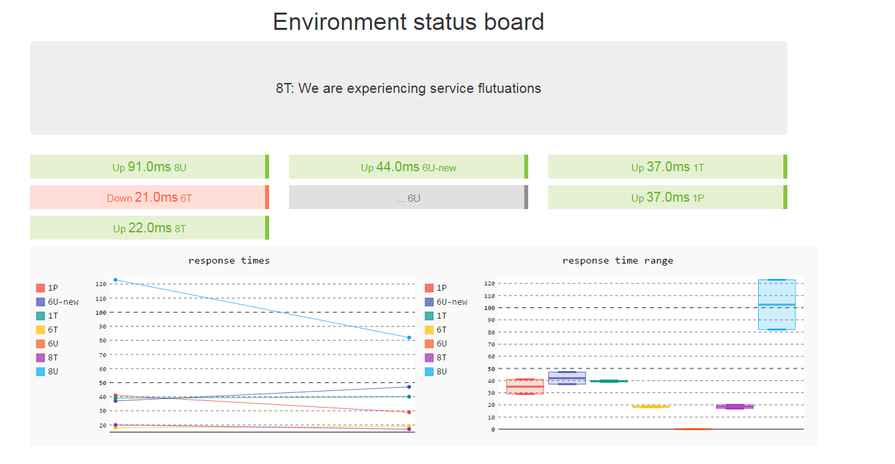

# status-board
A quick python based status board for endpoints ~~based on [Miracle-board](https://github.com/xhacker/miracle-board)~~ 
(It's become quite different from the project it was based on).

In summary:

- Lets you measure endpoints both via http and command line 
- Generates a few graphs
- Uses config file for easy addition of endpoints for monitoring


## Quick start

`Add some endpoints into the config.json`

```
pip install -r requirements.txt
pip install gunicorn //if you are on windows use a different container for running your flask site like twisted.
```
Edit the config file to point to the sites you care about
```
gunicorn -w 4 -b INTERFACE:5000 run:app --daemon
```
